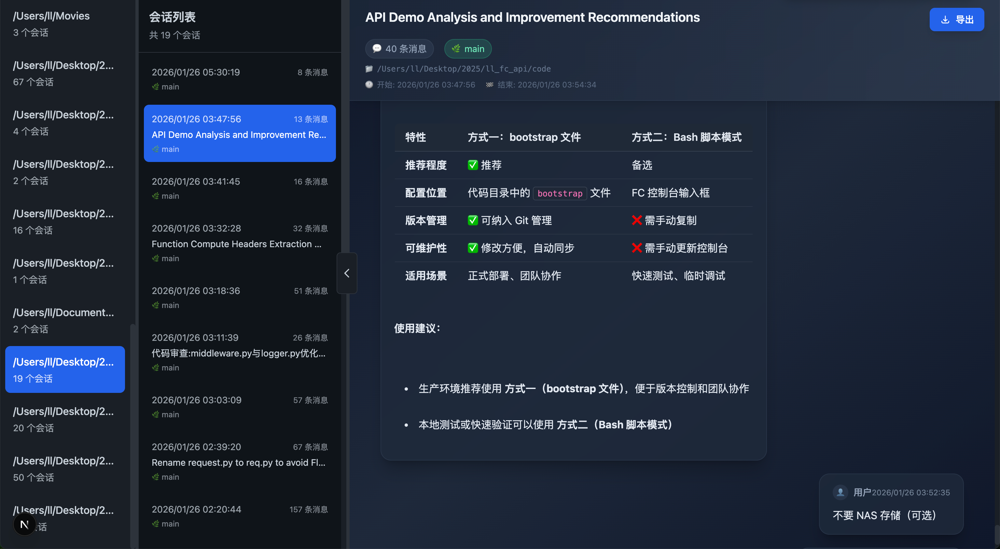

# Claude Code Chat Viewer

<div align="center">
  
</div>

一个美观、高效的 Claude Code CLI 聊天记录查看器，让你轻松浏览和管理所有的对话历史。

## ✨ 功能特性

- 📂 **项目管理** - 按目录查看所有 Claude Code 项目
- 💬 **会话浏览** - 查看单个项目的所有会话，按时间排序
- 🎨 **优雅界面** - 消息气泡样式展示，思考过程可折叠
- 📊 **数据统计** - Token 使用情况一目了然
- 🌿 **Git 集成** - 显示分支和工作目录信息
- ⚡ **高性能** - 基于 Next.js 15，响应迅速

## 🎯 使用方法

1. **左侧面板** - 显示所有 Claude Code 项目
2. **中间面板** - 点击项目后显示该项目的所有会话
3. **右侧面板** - 点击会话后显示完整的对话记录

## 🏗️ 技术栈

- **框架**: Next.js 15 (App Router)
- **语言**: TypeScript
- **样式**: Tailwind CSS
- **数据源**: `~/.claude/projects/` 目录下的 JSONL 文件

## 🚀 快速开始

### 方式一：一键安装为 Claude Code 技能（推荐）

**选项 1：克隆后安装**
```bash
git clone https://github.com/your-username/claude-chat-viewer.git
cd claude-chat-viewer
./install.sh
```

**选项 2：一键安装（无需克隆）**
```bash
curl -fsSL https://raw.githubusercontent.com/your-username/claude-chat-viewer/main/quick-install.sh | bash
```

安装完成后，在 Claude Code CLI 中说"查看聊天记录"即可自动启动，或者直接运行：

```bash
claude-chat-viewer          # 启动服务
claude-chat-viewer --stop   # 停止服务
claude-chat-viewer --status # 查看状态
claude-chat-viewer --logs   # 查看日志
```

> 💡 **提示**：记得将仓库 URL 中的 `your-username` 替换为你的 GitHub 用户名

### 方式二：直接运行

```bash
pnpm install
pnpm dev
```

访问 http://localhost:3000 查看应用

### 生产部署

```bash
pnpm build
pnpm start
```

## 📁 项目结构

```
claude-chat-viewer/
├── src/
│   ├── app/              # Next.js App Router
│   │   ├── api/         # API 路由
│   │   ├── layout.tsx   # 根布局
│   │   ├── page.tsx     # 主页面
│   │   └── globals.css  # 全局样式
│   ├── components/      # React 组件
│   ├── lib/            # 工具库
│   └── types/          # TypeScript 类型定义
├── public/             # 静态资源
└── package.json
```

## 🔌 API 接口

| 接口 | 说明 |
|------|------|
| `GET /api/projects` | 获取所有项目列表 |
| `GET /api/sessions/[projectPath]` | 获取指定项目的会话列表 |
| `GET /api/session/[sessionId]?projectPath=xxx` | 获取会话详细内容 |

## ⚠️ 注意事项

- 本应用仅用于查看本地 Claude Code 聊天记录
- 数据来源于 `~/.claude/projects/` 目录
- 无需网络连接，所有数据在本地处理，保护隐私安全

## 📄 许可证

MIT

---

<div align="center">
  如果这个项目对你有帮助，欢迎 ⭐ Star 支持！
</div>
